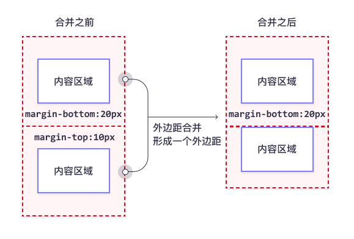

# 1 插入样式表
## 1.1 外部样式表
当样式需要被应用到很多页面的时候，外部样式表将是理想的选择。使用外部样式表，你就可以通过更改一个文件来改变整个站点的外观。
```> 
<head> 
  <link rel="stylesheet" type="text/css" href="mystyle.css"> 
</head>
```

## 1.2 内部样式表
当单个文件需要特别样式时，就可以使用内部样式表。你可以在 head 部分通过 <'style'> 标签定义内部样式表。
```
<head>
 <style type="text/css"> 
   body {background-color: red} 
   p {margin-left: 20px} 
 </style>
</head> 
 ```

## 1.3 内联样式
当特殊的样式需要应用到个别元素时，就可以使用内联样式。使用内联样式的方法是在相关的标签中使用样式属性。样式属性可以包含任何 CSS 属性。以下实例显示出如何改变段落的颜色和左外边距。
```
 <p style="color: red; margin-left: 20px"> This is a paragraph </p>
```


---

# 2 CSS基础
## 2.1 CSS选择器
### 2.1.1 CSS元素选择器
最常见的 CSS 选择器是元素选择器。换句话说，文档的元素就是最基本的选择器。
如果设置 HTML 的样式，选择器通常将是某个 HTML 元素，比如 p、h1、em、a，甚至可以是 html 本身：
```
h1 {color:blue;} 
h2 {color:silver;}
```

### 2.1.2 CSS类选择器
类选择器允许以一种独立于文档元素的方式来指定样式。
该选择器可以单独使用，也可以与其他元素结合使用。
```
<h1 class="important"> This heading is very important. </h1>
.important {color:red;}
```

### 2.1.3 CSS ID选择器
**ID 选择器前面有一个 # 号 - 也称为棋盘号或井号。**
```
 #intro {font-weight:bold;}
 ```

⚠️请注意，类选择器和 ID 选择器可能是区分大小写的
⚠️不同于类选择器，ID 选择器不能结合使用，因为 ID 属性不允许有以空格分隔的词列表。
### 2.1.4 CSS属性选择器
**属性选择器可以根据元素的属性及属性值来选择元素。**
例如，为了将同时有 href 和 title 属性的 HTML 超链接的文本设置为红色，可以这样写：
```
a[href][title] {
color:red;
}
<a title="W3School Home" href="http://w3school.com.cn">W3School</a>
```
| 选择器 | 描述 | 例子 | 例子描述 |
| --- | --- | --- | --- |
| [[attribute]](https://www.w3school.com.cn/cssref/selector_attribute.asp) | 用于选取带有指定属性的元素。 | [target] | 选择带有 target 属性的所有元素。 |
| [[attribute=value]](https://www.w3school.com.cn/cssref/selector_attribute_value.asp) | 用于选取带有指定属性和值的元素。 | [target=_blank] | 选择带有 target="_blank" 属性的所有元素。 |
| [[attribute~=value]](https://www.w3school.com.cn/cssref/selector_attribute_value_contain.asp) | 用于选取属性值中包含指定词汇的元素。 | [title~=flower] | 选择带有包含 "flower" 一词的 title 属性的所有元素。 |
| [[attribute&#124;=value]](https://www.w3school.com.cn/cssref/selector_attribute_value_start.asp) | 用于选取带有以指定值开头的属性值的元素，该值必须是整个单词。 | [lang&#124;=en] | 选择带有以 "en" 开头的 lang 属性的所有元素。 |
| [[attribute^=value]](https://www.w3school.com.cn/cssref/selector_attr_begin.asp) | 匹配属性值以指定值开头的每个元素。 | a[href^="https"] | 选择其 href 属性值以 "https" 开头的每个 <a> 元素。 |
| [[attribute$=value]](https://www.w3school.com.cn/cssref/selector_attr_end.asp) | 匹配属性值以指定值结尾的每个元素。 | a[href$=".pdf"] | 选择其 href 属性值以 ".pdf" 结尾的每个 <a> 元素。 |
| [[attribute*=value]](https://www.w3school.com.cn/cssref/selector_attr_contain.asp) | 匹配属性值中包含指定值的每个元素。 | a[href*="w3school"] | 选择其 href 属性值包含子串 "w3school" 的每个 <a> 元素。 |

### 2.1.5 CSS后代选择器
**后代选择器（descendant selector）又称为包含选择器。后代选择器可以选择作为某元素后代的元素。**
  ```
   h1 em {color:red;}
   <h1>This is a <em>important</em> heading</h1>
  ```

> 在后代选择器中，规则左边的选择器一端包括两个或多个用空格分隔的选择器。选择器之间的空格是一种结合符（combinator）。每个空格结合符可以解释为“... 在 ... 找到”、“... 作为 ... 的一部分”、“... 作为 ... 的后代”，但是要求必须从右向左读选择器。
> 因此，h1 em 选择器可以解释为 “作为 h1 元素后代的任何 em 元素”。如果要从左向右读选择器，可以换成以下说法：“包含 em 的所有 h1 会把以下样式应用到该 em”。

⚠️有关后代选择器有一个易被忽视的方面，即两个元素之间的**层次间隔**可以是**无限**的。
例如，如果写作 ul em，这个语法就会选择从 ul 元素继承的所有 em 元素，而不论 em 的嵌套层次多深。
### 2.1.6 CSS子元素选择器
**与后代选择器相比，子元素选择器（Child selectors）只能选择作为某元素子元素的元素。**
如果您不希望选择任意的后代元素，而是希望缩小范围，只选择某个元素的子元素，请使用子元素选择器（Child selector）。
例如，如果您希望选择只作为 h1 元素子元素的 strong 元素，可以这样写：
```
 h1 > strong {color:red;}
```

### 2.1.7 CSS相邻兄弟选择器
**相邻兄弟选择器（Adjacent sibling selector）可选择紧接在另一元素后的元素，且二者有相同父元素。**
如果需要选择紧接在另一个元素后的元素，而且二者有相同的父元素，可以使用相邻兄弟选择器（Adjacent sibling selector）。
例如，如果要增加紧接在 h1 元素后出现的段落的上边距，可以这样写：
```
 h1 + p {margin-top:50px;}
 ```

> 这个选择器读作：“选择紧接在 h1 元素后出现的段落，h1 和 p 元素拥有共同的父元素”。

## 2.2 CSS背景
| 属性 | 描述 |
| --- | --- |
| [background](https://www.w3school.com.cn/cssref/pr_background.asp) | 在一条声明中设置所有背景属性的简写属性。 |
| [background-attachment](https://www.w3school.com.cn/cssref/pr_background-attachment.asp) | 设置背景图像是固定的还是与页面的其余部分一起滚动。 |
| [background-clip](https://www.w3school.com.cn/cssref/pr_background-clip.asp) | 规定背景的绘制区域。 |
| [background-color](https://www.w3school.com.cn/cssref/pr_background-color.asp) | 设置元素的背景色。 |
| [background-image](https://www.w3school.com.cn/cssref/pr_background-image.asp) | 设置元素的背景图像。 |
| [background-origin](https://www.w3school.com.cn/cssref/pr_background-origin.asp) | 规定在何处放置背景图像。 |
| [background-position](https://www.w3school.com.cn/cssref/pr_background-position.asp) | 设置背景图像的开始位置。 |
| [background-repeat](https://www.w3school.com.cn/cssref/pr_background-repeat.asp) | 设置背景图像是否及如何重复。 |
| [background-size](https://www.w3school.com.cn/cssref/pr_background-size.asp) | 规定背景图像的尺寸。 |

⚠️CSS background - 简写属性
```
 body {   background: #ffffff url("tree.png") no-repeat right top; }
 ```

> 在使用简写属性时，属性值的顺序为：
> - background-color
> - background-image
> - background-repeat
> - background-attachment
> - background-position

## 2.3 CSS边框
| 属性 | 描述 |
| --- | --- |
| [border](https://www.w3school.com.cn/cssref/pr_border.asp) | 简写属性，在一条声明中设置所有边框属性。 |
| [border-color](https://www.w3school.com.cn/cssref/pr_border-color.asp) | 简写属性，设置四条边框的颜色。 |
| [border-radius](https://www.w3school.com.cn/cssref/pr_border-radius.asp) | 简写属性，可设置圆角的所有四个 border-*-radius 属性。 |
| [border-style](https://www.w3school.com.cn/cssref/pr_border-style.asp) | 简写属性，设置四条边框的样式。 |
| [border-width](https://www.w3school.com.cn/cssref/pr_border-width.asp) | 简写属性，设置四条边框的宽度。 |
| [border-bottom](https://www.w3school.com.cn/cssref/pr_border-bottom.asp) | 简写属性，在一条声明中设置所有下边框属性。 |
| [border-bottom-color](https://www.w3school.com.cn/cssref/pr_border-bottom-color.asp) | 设置下边框的颜色。 |
| [border-bottom-style](https://www.w3school.com.cn/cssref/pr_border-bottom-style.asp) | 设置下边框的样式。 |
| [border-bottom-width](https://www.w3school.com.cn/cssref/pr_border-bottom-width.asp) | 设置下边框的宽度。 |
| [border-left](https://www.w3school.com.cn/cssref/pr_border-left.asp) | 简写属性，在一条声明中设置所有左边框属性。 |
| [border-left-color](https://www.w3school.com.cn/cssref/pr_border-left-color.asp) | 设置左边框的颜色。 |
| [border-left-style](https://www.w3school.com.cn/cssref/pr_border-left-style.asp) | 设置左边框的样式。 |
| [border-left-width](https://www.w3school.com.cn/cssref/pr_border-left-width.asp) | 设置左边框的宽度。 |
| [border-right](https://www.w3school.com.cn/cssref/pr_border-right.asp) | 简写属性，在一条声明中设置所有右边框属性。 |
| [border-right-color](https://www.w3school.com.cn/cssref/pr_border-right-color.asp) | 设置右边框的颜色。 |
| [border-right-style](https://www.w3school.com.cn/cssref/pr_border-right-style.asp) | 设置右边框的样式。 |
| [border-right-width](https://www.w3school.com.cn/cssref/pr_border-right-width.asp) | 设置右边框的宽度。 |
| [border-top](https://www.w3school.com.cn/cssref/pr_border-top.asp) | 简写属性，在一条声明中设置所有上边框属性。 |
| [border-top-color](https://www.w3school.com.cn/cssref/pr_border-top-color.asp) | 设置上边框的颜色。 |
| [border-top-style](https://www.w3school.com.cn/cssref/pr_border-top-style.asp) | 设置上边框的样式。 |
| [border-top-width](https://www.w3school.com.cn/cssref/pr_border-top-width.asp) | 设置上边框的宽度。 |

## 2.3 CSS外边距
> 您可以将 margin 属性设置为 auto，以使元素在其容器中水平居中。
> 
> 然后，该元素将占据指定的宽度，并且剩余空间将在左右边界之间平均分配。
> 
> ⚠️外边距可以是负值，而且在很多情况下都要使用负值的外边距。

| 属性 | 描述 |
| --- | --- |
| [margin](https://www.w3school.com.cn/cssref/pr_margin.asp) | 用于在一条声明中设置外边距属性的简写属性。 |
| [margin-bottom](https://www.w3school.com.cn/cssref/pr_margin-bottom.asp) | 设置元素的下外边距。 |
| [margin-left](https://www.w3school.com.cn/cssref/pr_margin-left.asp) | 设置元素的左外边距。 |
| [margin-right](https://www.w3school.com.cn/cssref/pr_margin-right.asp) | 设置元素的右外边距。 |
| [margin-top](https://www.w3school.com.cn/cssref/pr_margin-top.asp) | 设置元素的上外边距。 |

> ⚠️**外边距合并指的是，当两个垂直外边距相遇时，它们将形成一个外边距。**
> **合并后的外边距的高度等于两个发生合并的外边距的高度中的较大者。**
> 
> **注释：**只有普通文档流中块框的垂直外边距才会发生外边距合并。行内框、浮动框或绝对定位之间的外边距不会合并。


## 2.4 CSS内边距
| 属性 | 描述 |
| --- | --- |
| [padding](https://www.w3school.com.cn/cssref/pr_padding.asp) | 用于在一条声明中设置所有内边距属性的简写属性。 |
| [padding-bottom](https://www.w3school.com.cn/cssref/pr_padding-bottom.asp) | 设置元素的下内边距。 |
| [padding-left](https://www.w3school.com.cn/cssref/pr_padding-left.asp) | 设置元素的左内边距。 |
| [padding-right](https://www.w3school.com.cn/cssref/pr_padding-right.asp) | 设置元素的右内边距。 |
| [padding-top](https://www.w3school.com.cn/cssref/pr_padding-top.asp) | 设置元素的上内边距。 |

## 2.5 CSS轮廓
> ⚠️**注意：**轮廓与[边框](https://www.w3school.com.cn/css/css_border.asp)不同！不同之处在于：轮廓是在元素边框之外绘制的，并且可能与其他内容重叠。同样，轮廓也不是元素尺寸的一部分；元素的总宽度和高度不受轮廓线宽度的影响。

| 属性 | 描述 |
| --- | --- |
| [outline](https://www.w3school.com.cn/cssref/pr_outline.asp) | 简写属性，在一条声明中设置 outline-width、outline-style 以及 outline-color。 |
| [outline-color](https://www.w3school.com.cn/cssref/pr_outline-color.asp) | 设置轮廓的颜色。 |
| [outline-offset](https://www.w3school.com.cn/cssref/pr_outline-offset.asp) | 指定轮廓与元素的边缘或边框之间的空间。 |
| [outline-style](https://www.w3school.com.cn/cssref/pr_outline-style.asp) | 设置轮廓的样式。 |
| [outline-width](https://www.w3school.com.cn/cssref/pr_outline-width.asp) | 设置轮廓的宽度。 |

## 2.6 CSS文本属性
| 属性 | 描述 |
| --- | --- |
| [color](https://www.w3school.com.cn/cssref/pr_text_color.asp) | 设置文本颜色。 |
| [direction](https://www.w3school.com.cn/cssref/pr_text_direction.asp) | 指定文本的方向 / 书写方向。 |
| [letter-spacing](https://www.w3school.com.cn/cssref/pr_text_letter-spacing.asp) | 设置字符间距。 |
| [line-height](https://www.w3school.com.cn/cssref/pr_dim_line-height.asp) | 设置行高。 |
| [text-align](https://www.w3school.com.cn/cssref/pr_text_text-align.asp) | 指定文本的水平对齐方式。 |
| [text-decoration](https://www.w3school.com.cn/cssref/pr_text_text-decoration.asp) | 指定添加到文本的装饰效果。 |
| [text-indent](https://www.w3school.com.cn/cssref/pr_text_text-indent.asp) | 指定文本块中首行的缩进。 |
| [text-shadow](https://www.w3school.com.cn/cssref/pr_text-shadow.asp) | 指定添加到文本的阴影效果。 |
| [text-transform](https://www.w3school.com.cn/cssref/pr_text_text-transform.asp) | 控制文本的大小写。 |
| [text-overflow](https://www.w3school.com.cn/cssref/pr_text-overflow.asp) | 指定应如何向用户示意未显示的溢出内容。 |
| [unicode-bidi](https://www.w3school.com.cn/cssref/pr_unicode-bidi.asp) | 与 direction 属性一起使用，设置或返回是否应重写文本来支持同一文档中的多种语言。 |
| [vertical-align](https://www.w3school.com.cn/cssref/pr_pos_vertical-align.asp) | 指定文本的垂直对齐方式。 |
| [white-space](https://www.w3school.com.cn/cssref/pr_text_white-space.asp) | 指定如何处理元素内的空白。 |
| [word-spacing](https://www.w3school.com.cn/cssref/pr_text_word-spacing.asp) | 设置单词间距。 |

## 2.7 CSS字体属性
| 属性 |  | 描述 |
| --- | --- | --- |
| [font](https://www.w3school.com.cn/cssref/pr_font_font.asp) |  | 简写属性。在一条声明中设置所有字体属性。 |
| [font-family](https://www.w3school.com.cn/cssref/pr_font_font-family.asp) |  | 规定文本的字体系列（字体族）。 |
| [font-size](https://www.w3school.com.cn/cssref/pr_font_font-size.asp) |  | 规定文本的字体大小。 |
|  | font-size:10vw | 视口（Viewport）是浏览器窗口的大小。 1vw = 视口宽度的 1％。如果视口为 50 厘米宽，则 1vw 为 0.5 厘米。 |
| [font-style](https://www.w3school.com.cn/cssref/pr_font_font-style.asp) |  | 规定文本的字体样式。 |
| [font-variant](https://www.w3school.com.cn/cssref/pr_font_font-variant.asp) |  | 规定是否以小型大写字母的字体显示文本。 |
|  | normal | 默认值。浏览器会显示一个标准的字体。 |
|  | small-caps | 浏览器会显示小型大写字母的字体。 |
|  | inherit | 规定应该从父元素继承 font-variant 属性的值。 |
| [font-weight](https://www.w3school.com.cn/cssref/pr_font-weight.asp) |  | 规定字体的粗细。 |

> 为了缩短代码，也可以在一个属性中指定所有单个字体属性。
> font 属性是以下属性的简写属性：
> - font-style
> - font-variant
> - font-weight
> - font-size/line-height
> - font-family

```
p.b {   font: italic small-caps bold 12px/30px Georgia, serif; }
```

## 2.8 CSS链接
四种链接状态分别是：

- a:link - 正常的，未访问的链接
- a:visited - 用户访问过的链接
- a:hover - 用户将鼠标悬停在链接上时
- a:active - 链接被点击时
> ⚠️如果为多个链接状态设置样式，请遵循如下顺序规则：
> - a:hover 必须 a:link 和 a:visited 之后
> - a:active 必须在 a:hover 之后

## 2.9 CSS列表
| 属性 | 描述 |
| --- | --- |
| [list-style](https://www.w3school.com.cn/cssref/pr_list-style.asp) | 简写属性。在一条声明中设置列表的所有属性。 |
| [list-style-image](https://www.w3school.com.cn/cssref/pr_list-style-image.asp) | 指定图像作为列表项标记。 |
| [list-style-position](https://www.w3school.com.cn/cssref/pr_list-style-position.asp) | 规定列表项标记（项目符号）的位置。 |
| [list-style-type](https://www.w3school.com.cn/cssref/pr_list-style-type.asp) | 规定列表项标记的类型。 |

## 2.10 CSS表格属性
| 属性 |  | 描述                                                      |
| --- | --- |---------------------------------------------------------|
| [border](https://www.w3school.com.cn/cssref/pr_border.asp) |  | 简写属性。在一条声明中设置所有边框属性。                                    |
| [border-collapse](https://www.w3school.com.cn/cssref/pr_border-collapse.asp) |  | 规定是否应折叠表格边框。                                            |
|  | separate | 默认值。边框会被分开。不会忽略 border-spacing 和 empty-cells 属性。        |
|  | collapse | 如果可能，边框会合并为一个单一的边框。会忽略 border-spacing 和 empty-cells 属性。 |
|  | inherit | 规定应该从父元素继承 border-collapse 属性的值。                        |
| [border-spacing](https://www.w3school.com.cn/cssref/pr_border-spacing.asp) |  | 规定相邻单元格之间的边框的距离。                                        |
| [caption-side](https://www.w3school.com.cn/cssref/pr_tab_caption-side.asp) |  | 规定表格标题的位置。                                              |
|  | top | 默认值。把表格标题定位在表格之上。                                       |
|  | bottom | 把表格标题定位在表格之下。                                           |
|  | inherit | 规定应该从父元素继承 caption-side 属性的值。                           |
| [empty-cells](https://www.w3school.com.cn/cssref/pr_tab_empty-cells.asp) |  | 规定是否在表格中的空白单元格上显示边框和背景。                                 |
|  | hide | 不在空单元格周围绘制边框。                                           |
|  | show | 在空单元格周围绘制边框。默认。                                         |
|  | inherit | 规定应该从父元素继承 empty-cells 属性的值。                            |
| [table-layout](https://www.w3school.com.cn/cssref/pr_tab_table-layout.asp) |  | 设置用于表格的布局算法。                                            |
|  | automatic | 默认。列宽度由单元格内容设定。                                         |
|  | fixed | 列宽由表格宽度和列宽度设定。                                          |
|  | inherit | 规定应该从父元素继承 table-layout 属性的值。                           |
| text-align |  | 默认情况下，<th//> 元素的内容居中对齐，而 <td//> 元素的内容左对齐。               |

> #### 可悬停表格
> 在 <tr> 元素上使用 :hover 选择器，以突出显示鼠标悬停时的表格行：
 ```
 tr:hover {background-color: #f5f5f5;}
 ```

> #### 条状表格
> 为了实现斑马纹表格效果，请使用 nth-child() 选择器，并为所有偶数（或奇数）表行添加 background-color：

```
tr:nth-child(even) {background-color: #f2f2f2;}
```

> #### 响应式表格
> 如果屏幕太小而无法显示全部内容，则响应式表格会显示水平滚动条：
> 在 <table//> 元素周围添加带有 overflow-x:auto 的容器元素（例如 <div//>），以实现响应式效果：

```
<div style="overflow-x:auto;"> 
  <table> 
  ... table content ... 
  </table> 
</div>
```


# 3 CSS中级教程
## 3.1 CSS display属性
display 属性规定是否/如何显示元素。
每个 HTML 元素都有一个默认的 display 值，具体取决于它的元素类型。大多数元素的默认 display 值为 block 或 inline。

**块级元素（block element）**: 块级元素总是从新行开始，并占据可用的全部宽度（尽可能向左和向右伸展）。

* ● <div//>
* ● <h1//> - <h6//>
* ● <p//>
* ● <form//>
* ● <header//>
* ● <footer//>
* ● <section//>

**行内元素（inline element）**: 内联元素不从新行开始，仅占用所需的宽度。
* ● <span//>
* ● <a//>
* ● 

**CSS Display/Visibility 属性**

| 属性 |  | 描述 | 说明 |
| --- | --- | --- | --- |
| [display](https://www.w3school.com.cn/cssref/pr_class_display.asp) |  | 指定应如何显示元素。 | 
|
|  | none | 此元素不会被显示。 | 从文档中删除元素。它不会占据任何空间。 |
|  | block | 此元素将显示为块级元素，此元素前后会带有换行符。 |  |
|  | inline | 默认。此元素会被显示为内联元素，元素前后没有换行符。 |  |
|  | inline-block | 行内块元素。 | （CSS2.1 新增的值） |
|  | list-item | 此元素会作为列表显示。 |  |
|  | run-in | 此元素会根据上下文作为块级元素或内联元素显示。 |  |
| [visibility](https://www.w3school.com.cn/cssref/pr_class_visibility.asp) |  | 指定元素是否应该可见。 |  |
|  | visible | 默认值。元素是可见的。 |  |
|  | hidden | 元素是不可见的。 | 隐藏元素，但仍占据布局中的空间。 |
|  | collapse | 当在表格元素中使用时，此值可删除一行或一列，但是它不会影响表格的布局。被行或列占据的空间会留给其他内容使用。如果此值被用在其他的元素上，会呈现为 "hidden"。 |  |
|  | inherit | 规定应该从父元素继承 visibility 属性的值。 |  |

## 3.2 CSS white-space 属性
white-space 属性设置如何处理元素内的空白。

| 属性 | 值 | 描述 |
| --- | --- | --- |
| white-space | normal | 默认。空白会被浏览器忽略。 |
|  | pre | 空白会被浏览器保留。其行为方式类似 HTML 中的 <pre> 标签。 |
|  | nowrap | 文本不会换行，文本会在在同一行上继续，直到遇到 <br> 标签为止。 |
|  | pre-wrap | 保留空白符序列，但是正常地进行换行。 |
|  | pre-line | 合并空白符序列，但是保留换行符。 |
|  | inherit | 规定应该从父元素继承 white-space 属性的值。 |

## 3.3 CSS 定位 position 属性
position 属性规定应用于元素的定位方法的类型（static、relative、fixed、absolute 或 sticky）。
> 元素其实是使用 top、bottom、left 和 right 属性定位的。但是，除非首先设置了 position 属性，否则这些属性将不起作用。根据不同的 position 值，它们的工作方式也不同。

| 属性 | 值 | 描述 |
| --- | --- | --- |
| **position** | static | HTML 元素默认情况下的定位方式为 static（静态） |
|  | relative | position: relative; 的元素相对于其正常位置进行定位。 |
|  | fixed | position: fixed; 的元素是相对于**视口定位**的，这意味着即使滚动页面，它也始终位于同一位置。 top、right、bottom 和 left 属性用于定位此元素。 |
|  | absolute | position: absolute; 的元素相对于**最近的定位祖先元素进行定位**（而不是相对于视口定位，如 fixed。
然而，如果绝对定位的元素没有祖先，它将使用文档主体（body），并随页面滚动一起移动。 |
|  | sticky | position: sticky; 的元素根据用户的滚动位置进行定位。
粘性元素根据滚动位置在**相对（relative）和固定（fixed）**之间切换。起先它会被相对定位，直到在视口中遇到给定的偏移位置为止 - 然后将其“粘贴”在适当的位置（比如 position:fixed）。 |
| z-index |  | z-index 属性指定元素的堆栈顺序（哪个元素应放置在其他元素的前面或后面）。 |

## 3.4 CSS overflow属性
overflow 属性指定在元素的内容太大而无法放入指定区域时是剪裁内容还是添加滚动条。

| 属性 | 描述 |
| --- | --- |
| [overflow](https://www.w3schools.com/cssref/pr_pos_overflow.asp) | 规定如果内容溢出元素框会发生什么情况。 |
| [overflow-x](https://www.w3schools.com/cssref/css3_pr_overflow-x.asp) | 规定在元素的内容区域溢出时如何处理内容的左/右边缘。 |
| [overflow-y](https://www.w3schools.com/cssref/css3_pr_overflow-y.asp) | 指定在元素的内容区域溢出时如何处理内容的上/下边缘。 |

| 属性 | 值 | 描述 |
| --- | --- | --- |
| overflow | visible | 默认。溢出没有被剪裁。内容在元素框外渲染 |
|  | hidden | 溢出被剪裁，其余内容将不可见 |
|  | scroll | 溢出被剪裁，同时添加滚动条以查看其余内容 |
|  | auto | 与 scroll 类似，但仅在必要时添加滚动条 |

**注释：**overflow 属性仅适用于具有指定高度的块元素。

## 3.5 CSS 浮动和清除
CSS float 属性规定元素如何浮动。
CSS clear 属性规定哪些元素可以在清除的元素旁边以及在哪一侧浮动。

| 属性 | 描述 |
| --- | --- |
| float | 
- left - 元素浮动到其容器的左侧
 |
|  | 
- lright - 元素浮动在其容器的右侧
 |
|  | 
- none - 元素不会浮动（将显示在文本中刚出现的位置）。默认值。
 |
|  | 
- inherit - 元素继承其父级的 float 值
 |

| 属性 | 描述 |
| --- | --- |
| clear | 
- none - 允许两侧都有浮动元素。默认值
 |
|  | 
- left - 左侧不允许浮动元素
 |
|  | 
- right- 右侧不允许浮动元素
 |
|  | 
- both - 左侧或右侧均不允许浮动元素
 |
|  | 
- inherit - 元素继承其父级的 clear 值
 |

| 属性 | 描述 | 示例 |
| --- | --- | --- |
| clearfix Hack | 如果一个元素比包含它的元素高，并且它是浮动的，它将“溢出”到其容器之外：
然后我们可以向包含元素添加 overflow: auto;，来解决此问题： | > .clearfix {   overflow: auto; }

 |
|  | 新的现代 clearfix hack 技术使用起来更安全 | > .clearfix::after {   content: "";   clear: both;   display: table; }

 |

## 3.6 CSS 组合器
| 选择器 | 示例 | 示例描述 |
| --- | --- | --- |
| [elementelement](https://www.w3school.com.cn/cssref/selector_element_element.asp) | div p | 选择 <div> 元素内的所有 <p> 元素。 |
| [element>element](https://www.w3school.com.cn/cssref/selector_element_gt.asp) | div > p | 选择其父元素是 <div> 元素的所有 <p> 元素。 |
| [element+element](https://www.w3school.com.cn/cssref/selector_element_plus.asp) | div + p | 选择所有紧随 <div> 元素之后的 <p> 元素。 |
| [element1~element2](https://www.w3school.com.cn/cssref/selector_gen_sibling.asp) | p ~ ul | 选择前面有 <p> 元素的每个 <ul> 元素。 |

## 3.7 CSS 伪类与伪元素
伪类用于定义元素的特殊状态。
例如，它可以用于：

- 设置鼠标悬停在元素上时的样式
- 为已访问和未访问链接设置不同的样式
- 设置元素获得焦点时的样式

**所有 CSS 伪类**

| 选择器 | 例子 | 例子描述 |
| --- | --- | --- |
| [:active](https://www.w3school.com.cn/cssref/selector_active.asp) | a:active | 选择活动的链接。 |
| [:checked](https://www.w3school.com.cn/cssref/selector_checked.asp) | input:checked | 选择每个被选中的 <input> 元素。 |
| [:disabled](https://www.w3school.com.cn/cssref/selector_disabled.asp) | input:disabled | 选择每个被禁用的 <input> 元素。 |
| [:empty](https://www.w3school.com.cn/cssref/selector_empty.asp) | p:empty | 选择没有子元素的每个 <p> 元素。 |
| [:enabled](https://www.w3school.com.cn/cssref/selector_enabled.asp) | input:enabled | 选择每个已启用的 <input> 元素。 |
| [:first-child](https://www.w3school.com.cn/cssref/selector_first-child.asp) | p:first-child | 选择作为其父的首个子元素的每个 <p> 元素。 |
| [:first-of-type](https://www.w3school.com.cn/cssref/selector_first-of-type.asp) | p:first-of-type | 选择作为其父的首个 <p> 元素的每个 <p> 元素。 |
| [:focus](https://www.w3school.com.cn/cssref/selector_focus.asp) | input:focus | 选择获得焦点的 <input> 元素。 |
| [:hover](https://www.w3school.com.cn/cssref/selector_hover.asp) | a:hover | 选择鼠标悬停其上的链接。 |
| [:in-range](https://www.w3school.com.cn/cssref/selector_in-range.asp) | input:in-range | 选择具有指定范围内的值的 <input> 元素。 |
| [:invalid](https://www.w3school.com.cn/cssref/selector_invalid.asp) | input:invalid | 选择所有具有无效值的 <input> 元素。 |
| [:lang(language)](https://www.w3school.com.cn/cssref/selector_lang.asp) | p:lang(it) | 选择每个 lang 属性值以 "it" 开头的 <p> 元素。 |
| [:last-child](https://www.w3school.com.cn/cssref/selector_last-child.asp) | p:last-child | 选择作为其父的最后一个子元素的每个 <p> 元素。 |
| [:last-of-type](https://www.w3school.com.cn/cssref/selector_last-of-type.asp) | p:last-of-type | 选择作为其父的最后一个 <p> 元素的每个 <p> 元素。 |
| [:link](https://www.w3school.com.cn/cssref/selector_link.asp) | a:link | 选择所有未被访问的链接。 |
| [:not(selector)](https://www.w3school.com.cn/cssref/selector_not.asp) | :not(p) | 选择每个非 <p> 元素的元素。 |
| [:nth-child(n)](https://www.w3school.com.cn/cssref/selector_nth-child.asp) | p:nth-child(2) | 选择作为其父的第二个子元素的每个 <p> 元素。 |
| [:nth-last-child(n)](https://www.w3school.com.cn/cssref/selector_nth-last-child.asp) | p:nth-last-child(2) | 选择作为父的第二个子元素的每个<p>元素，从最后一个子元素计数。 |
| [:nth-last-of-type(n)](https://www.w3school.com.cn/cssref/selector_nth-last-of-type.asp) | p:nth-last-of-type(2) | 选择作为父的第二个<p>元素的每个<p>元素，从最后一个子元素计数 |
| [:nth-of-type(n)](https://www.w3school.com.cn/cssref/selector_nth-of-type.asp) | p:nth-of-type(2) | 选择作为其父的第二个 <p> 元素的每个 <p> 元素。 |
| [:only-of-type](https://www.w3school.com.cn/cssref/selector_only-of-type.asp) | p:only-of-type | 选择作为其父的唯一 <p> 元素的每个 <p> 元素。 |
| [:only-child](https://www.w3school.com.cn/cssref/selector_only-child.asp) | p:only-child | 选择作为其父的唯一子元素的 <p> 元素。 |
| [:optional](https://www.w3school.com.cn/cssref/selector_optional.asp) | input:optional | 选择不带 "required" 属性的 <input> 元素。 |
| [:out-of-range](https://www.w3school.com.cn/cssref/selector_out-of-range.asp) | input:out-of-range | 选择值在指定范围之外的 <input> 元素。 |
| [:read-only](https://www.w3school.com.cn/cssref/selector_read-only.asp) | input:read-only | 选择指定了 "readonly" 属性的 <input> 元素。 |
| [:read-write](https://www.w3school.com.cn/cssref/selector_read-write.asp) | input:read-write | 选择不带 "readonly" 属性的 <input> 元素。 |
| [:required](https://www.w3school.com.cn/cssref/selector_required.asp) | input:required | 选择指定了 "required" 属性的 <input> 元素。 |
| [:root](https://www.w3school.com.cn/cssref/selector_root.asp) | root | 选择元素的根元素。 |
| [:target](https://www.w3school.com.cn/cssref/selector_target.asp) | #news:target | 选择当前活动的 #news 元素（单击包含该锚名称的 URL）。 |
| [:valid](https://www.w3school.com.cn/cssref/selector_valid.asp) | input:valid | 选择所有具有有效值的 <input> 元素。 |
| [:visited](https://www.w3school.com.cn/cssref/selector_visited.asp) | a:visited | 选择所有已访问的链接。 |

**所有 CSS 伪元素**

| 选择器 | 例子 | 例子描述 |
| --- | --- | --- |
| [::after](https://www.w3school.com.cn/cssref/selector_after.asp) | p::after | 在每个 <p> 元素之后插入内容。 |
| [::before](https://www.w3school.com.cn/cssref/selector_before.asp) | p::before | 在每个 <p> 元素之前插入内容。 |
| [::first-letter](https://www.w3school.com.cn/cssref/selector_first-letter.asp) | p::first-letter | 选择每个 <p> 元素的首字母。 |
| [::first-line](https://www.w3school.com.cn/cssref/selector_first-line.asp) | p::first-line | 选择每个 <p> 元素的首行。 |
| [::selection](https://www.w3school.com.cn/cssref/selector_selection.asp) | p::selection | 选择用户选择的元素部分。 |

## 3.8 CSS 不透明度 / 透明度
**opacity 属性指定元素的不透明度/透明度。**opacity 属性的取值范围为 0.0-1.0。值越低，越透明。
注意：

| 选择器 | 例子 | 例子描述 |
| --- | --- | --- |
| opacity: 0.1 |  | 使用 opacity 属性为元素的背景添加透明度时，其所有子元素都继承相同的透明度。 |
| background: rgba(76, 175, 80, 0.1) |  | 如果您不希望对子元素应用不透明度，如上面的例子，请使用 RGBA 颜色值。 |

## 3.9 CSS 计数器
| 属性 | 描述 |
| --- | --- |
| [content](https://www.w3school.com.cn/cssref/pr_gen_content.asp) | 与 ::before 和 ::after 伪元素一同使用，来插入生成的内容。 |
| [counter-increment](https://www.w3school.com.cn/cssref/pr_gen_counter-increment.asp) | 递增一个或多个计数器值。 |
| [counter-reset](https://www.w3school.com.cn/cssref/pr_gen_counter-reset.asp) | 创建或重置一个或多个计数器。 |

## 3.10 CSS 单位
**绝对长度**
绝对长度单位是固定的，用任何一个绝对长度表示的长度都将恰好显示为这个尺寸。
不建议在屏幕上使用绝对长度单位，因为屏幕尺寸变化很大。但是，如果已知输出介质，则可以使用它们，例如用于打印布局（print layout）。

| 单位 | 描述 | TIY |
| --- | --- | --- |
| cm | 厘米 | [试一试](https://www.w3school.com.cn/tiy/t.asp?f=cssref_unit_cm) |
| mm | 毫米 | [试一试](https://www.w3school.com.cn/tiy/t.asp?f=cssref_unit_mm) |
| in | 英寸 (1in = 96px = 2.54cm) | [试一试](https://www.w3school.com.cn/tiy/t.asp?f=cssref_unit_in) |
| px * | 像素 (1px = 1/96th of 1in) | [试一试](https://www.w3school.com.cn/tiy/t.asp?f=cssref_unit_px) |
| pt | 点 (1pt = 1/72 of 1in) | [试一试](https://www.w3school.com.cn/tiy/t.asp?f=cssref_unit_pt) |
| pc | 派卡 (1pc = 12 pt) | [试一试](https://www.w3school.com.cn/tiy/t.asp?f=cssref_unit_pc) |

***** 像素（px）是相对于观看设备的。对于低 dpi 的设备，1px 是显示器的一个设备像素（点）。对于打印机和高分辨率屏幕，1px 表示多个设备像素。
**相对长度**
相对长度单位规定相对于另一个长度属性的长度。相对长度单位在不同渲染介质之间缩放表现得更好。

| 单位 | 描述 | TIY |
| --- | --- | --- |
| em | 相对于元素的字体大小（font-size）（2em 表示当前字体大小的 2 倍） | [试一试](https://www.w3school.com.cn/tiy/t.asp?f=cssref_unit_em) |
| ex | 相对于当前字体的 x-height(极少使用) | [试一试](https://www.w3school.com.cn/tiy/t.asp?f=cssref_unit_ex) |
| ch | 相对于 "0"（零）的宽度 | [试一试](https://www.w3school.com.cn/tiy/t.asp?f=cssref_unit_ch) |
| rem | 相对于根元素的字体大小（font-size） | [试一试](https://www.w3school.com.cn/tiy/t.asp?f=cssref_unit_rem) |
| vw | 相对于视口*宽度的 1% | [试一试](https://www.w3school.com.cn/tiy/t.asp?f=cssref_unit_vw) |
| vh | 相对于视口*高度的 1% | [试一试](https://www.w3school.com.cn/tiy/t.asp?f=cssref_unit_vh) |
| vmin | 相对于视口*较小尺寸的 1％ | [试一试](https://www.w3school.com.cn/tiy/t.asp?f=cssref_unit_vmin) |
| vmax | 相对于视口*较大尺寸的 1％ | [试一试](https://www.w3school.com.cn/tiy/t.asp?f=cssref_unit_vmax) |
| % | 相对于父元素 | [试一试](https://www.w3school.com.cn/tiy/t.asp?f=cssref_unit_percentage) |

**提示：**em 和 rem 单元可用于创建完美的可扩展布局！
***** 视口（Viewport）= 浏览器窗口的尺寸。如果视口为 50 厘米宽，则 1vw = 0.5 厘米。
## 3.11 CSS 多重背景
**CSS 高级背景属性**

| 属性 | 描述 |
| --- | --- |
| [background](https://www.w3school.com.cn/cssref/pr_background.asp) | 用于在一条声明中设置所有背景属性的简写属性。 |
| [background-clip](https://www.w3school.com.cn/cssref/pr_background-clip.asp) | 规定背景的绘制区域。 |
| [background-image](https://www.w3school.com.cn/cssref/pr_background-image.asp) | 为一个元素指定一幅或多幅背景图像。 |
| [background-origin](https://www.w3school.com.cn/cssref/pr_background-origin.asp) | 规定背景图像的放置位置。 |
| [background-size](https://www.w3school.com.cn/cssref/pr_background-size.asp) | 规定背景图像的大小。 |

## 3.12 CSS 阴影
| 属性 | 描述 |
| --- | --- |
| [box-shadow](https://www.w3school.com.cn/cssref/pr_box-shadow.asp) | 向一个元素添加一个或多个阴影。 |
| [text-shadow](https://www.w3school.com.cn/cssref/pr_text-shadow.asp) | 在文本中添加一个或多个阴影。 |

# 4 CSS高级教程
## 4.1 CSS文本效果属性
下表列出了 CSS 文本效果属性：

| 属性 | 描述 |
| --- | --- |
| [text-align-last](https://www.w3school.com.cn/cssref/pr_text-align-last.asp) | 指定如何对齐文本的最后一行。 |
| [text-justify](https://www.w3school.com.cn/cssref/pr_text-justify.asp) | 指定对齐的文本应如何对齐和间隔。 |
| [text-overflow](https://www.w3school.com.cn/cssref/pr_text-overflow.asp) | 指定应如何向用户呈现未显示的溢出内容。 |
| [word-break](https://www.w3school.com.cn/cssref/pr_word-break.asp) | 指定非 CJK 脚本的换行规则。 |
| [word-wrap](https://www.w3school.com.cn/cssref/pr_word-wrap.asp) | 允许长单词被打断并换到下一行。 |
| [writing-mode](https://www.w3school.com.cn/cssref/pr_writing-mode.asp) | 指定文本行是水平放置还是垂直放置。 |

## 4.2 CSS 2D 转换
**下表列出了所有 2D 变换属性：**

| 属性 | 描述 |
| --- | --- |
| [transform](https://www.w3school.com.cn/cssref/pr_transform.asp) | 向元素应用 2D 或 3D 转换。 |
| [transform-origin](https://www.w3school.com.cn/cssref/pr_transform-origin.asp) | 允许你改变被转换元素的位置。 |

**CSS 2D 转换方法**

| 函数 | 描述 |
| --- | --- |
| matrix(_n_,_n_,_n_,_n_,_n_,_n_) | 定义 2D 转换，使用六个值的矩阵。 |
| translate(_x_,_y_) | 定义 2D 转换，沿着 X 和 Y 轴移动元素。 |
| translateX(_n_) | 定义 2D 转换，沿着 X 轴移动元素。 |
| translateY(_n_) | 定义 2D 转换，沿着 Y 轴移动元素。 |
| scale(_x_,_y_) | 定义 2D 缩放转换，改变元素的宽度和高度。 |
| scaleX(_n_) | 定义 2D 缩放转换，改变元素的宽度。 |
| scaleY(_n_) | 定义 2D 缩放转换，改变元素的高度。 |
| rotate(_angle_) | 定义 2D 旋转，在参数中规定角度。 |
| skew(_x-angle_,_y-angle_) | 定义 2D 倾斜转换，沿着 X 和 Y 轴。 |
| skewX(_angle_) | 定义 2D 倾斜转换，沿着 X 轴。 |
| skewY(_angle_) | 定义 2D 倾斜转换，沿着 Y 轴。 |

## 4.3 CSS 3D 转换
下表列出了所有 3D 变换属性：

| 属性 | 描述 |
| --- | --- |
| [transform](https://www.w3school.com.cn/cssref/pr_transform.asp) | 向元素应用 2D 或 3D 转换。 |
| [transform-origin](https://www.w3school.com.cn/cssref/pr_transform-origin.asp) | 允许你改变被转换元素的位置。 |
| [transform-style](https://www.w3school.com.cn/cssref/pr_transform-style.asp) | 规定被嵌套元素如何在 3D 空间中显示。 |
| [perspective](https://www.w3school.com.cn/cssref/pr_perspective.asp) | 规定 3D 元素的透视效果。 |
| [perspective-origin](https://www.w3school.com.cn/cssref/pr_perspective-origin.asp) | 规定 3D 元素的底部位置。 |
| [backface-visibility](https://www.w3school.com.cn/cssref/pr_backface-visibility.asp) | 定义元素在不面对屏幕时是否可见。 |

CSS 3D 转换方法

| 函数 | 描述 |
| --- | --- |
| matrix3d(_n_,_n_,_n_,_n_,_n_,_n_,
_n_,_n_,_n_,_n_,_n_,_n_,_n_,_n_,_n_,_n_) | 定义 3D 转换，使用 16 个值的 4x4 矩阵。 |
| translate3d(_x_,_y_,_z_) | 定义 3D 转化。 |
| translateX(_x_) | 定义 3D 转化，仅使用用于 X 轴的值。 |
| translateY(_y_) | 定义 3D 转化，仅使用用于 Y 轴的值。 |
| translateZ(_z_) | 定义 3D 转化，仅使用用于 Z 轴的值。 |
| scale3d(_x_,_y_,_z_) | 定义 3D 缩放转换。 |
| scaleX(_x_) | 定义 3D 缩放转换，通过给定一个 X 轴的值。 |
| scaleY(_y_) | 定义 3D 缩放转换，通过给定一个 Y 轴的值。 |
| scaleZ(_z_) | 定义 3D 缩放转换，通过给定一个 Z 轴的值。 |
| rotate3d(_x_,_y_,_z_,_angle_) | 定义 3D 旋转。 |
| rotateX(_angle_) | 定义沿 X 轴的 3D 旋转。 |
| rotateY(_angle_) | 定义沿 Y 轴的 3D 旋转。 |
| rotateZ(_angle_) | 定义沿 Z 轴的 3D 旋转。 |
| perspective(_n_) | 定义 3D 转换元素的透视视图。 |

## 4.4 CSS 过渡属性
下表列出了所有 CSS 过渡属性：

| 属性 | 描述 |
| --- | --- |
| [transition](https://www.w3school.com.cn/cssref/pr_transition.asp) | 简写属性，用于将四个过渡属性设置为单一属性。 |
| [transition-delay](https://www.w3school.com.cn/cssref/pr_transition-delay.asp) | 规定过渡效果的延迟（以秒计）。 |
| [transition-duration](https://www.w3school.com.cn/cssref/pr_transition-duration.asp) | 规定过渡效果要持续多少秒或毫秒。 |
| [transition-property](https://www.w3school.com.cn/cssref/pr_transition-property.asp) | 规定过渡效果所针对的 CSS 属性的名称。 |
| [transition-timing-function](https://www.w3school.com.cn/cssref/pr_transition-timing-function.asp) | 规定过渡效果的速度曲线。 |


## 4.5 CSS 动画属性
下表列出了 @keyframes 规则和所有 CSS 动画属性：

| 属性 | 描述 |
| --- | --- |
| [@keyframes](https://www.w3school.com.cn/cssref/pr_keyframes.asp) | 规定动画模式。 |
| [animation](https://www.w3school.com.cn/cssref/pr_animation.asp) | 设置所有动画属性的简写属性。 |
| [animation-delay](https://www.w3school.com.cn/cssref/pr_animation-delay.asp) | 规定动画开始的延迟。 |
| [animation-direction](https://www.w3school.com.cn/cssref/pr_animation-direction.asp) | 定动画是向前播放、向后播放还是交替播放。 |
| [animation-duration](https://www.w3school.com.cn/cssref/pr_animation-duration.asp) | 规定动画完成一个周期应花费的时间。 |
| [animation-fill-mode](https://www.w3school.com.cn/cssref/pr_animation-fill-mode.asp) | 规定元素在不播放动画时的样式（在开始前、结束后，或两者同时）。 |
| [animation-iteration-count](https://www.w3school.com.cn/cssref/pr_animation-iteration-count.asp) | 规定动画应播放的次数。 |
| [animation-name](https://www.w3school.com.cn/cssref/pr_animation-name.asp) | 规定 @keyframes 动画的名称。 |
| [animation-play-state](https://www.w3school.com.cn/cssref/pr_animation-play-state.asp) | 规定动画是运行还是暂停。 |
| [animation-timing-function](https://www.w3school.com.cn/cssref/pr_animation-timing-function.asp) | 规定动画的速度曲线。 |

## 4.6 CSS 多列
CSS 多列布局允许我们轻松定义多列文本 - 就像报纸那样：

| 属性 | 描述 |
| --- | --- |
| [column-count](https://www.w3school.com.cn/cssref/pr_column-count.asp) | 规定元素应划分的列数。 |
| [column-fill](https://www.w3school.com.cn/cssref/pr_column-fill.asp) | 规定如何填充列。 |
| [column-gap](https://www.w3school.com.cn/cssref/pr_column-gap.asp) | 指定列之间的间隙。 |
| [column-rule](https://www.w3school.com.cn/cssref/pr_column-rule.asp) | 用于设置所有 column-rule-* 属性的简写属性。 |
| [column-rule-color](https://www.w3school.com.cn/cssref/pr_column-rule-color.asp) | 规定列之间规则的颜色。 |
| [column-rule-style](https://www.w3school.com.cn/cssref/pr_column-rule-style.asp) | 规定列之间的规则样式。 |
| [column-rule-width](https://www.w3school.com.cn/cssref/pr_column-rule-width.asp) | 规定列之间的规则宽度。 |
| [column-span](https://www.w3school.com.cn/cssref/pr_column-span.asp) | 规定一个元素应该跨越多少列。 |
| [column-width](https://www.w3school.com.cn/cssref/pr_column-width.asp) | 为列指定建议的最佳宽度。 |
| [columns](https://www.w3school.com.cn/cssref/css3_pr_columns.asp) | 用于设置 column-width 和 column-count 的简写属性。 |

## 4.7 CSS 用户界面属性
| 属性 | 描述 |
| --- | --- |
| [outline-offset](https://www.w3school.com.cn/cssref/pr_outline-offset.asp) | 在轮廓和元素的边框边缘之间添加空间。 |
| [resize](https://www.w3school.com.cn/cssref/pr_resize.asp) | 规定元素是否可由用户调整大小。 |

## 4.8 CSS var() 函数
首先定义一个名为 "--main-bg-color" 的自定义属性，然后使用 var() 函数在样式表中插入该自定义属性的值
:::success
var(_custom-property-name_, _value_)
:::
| 值 | 描述 |
| --- | --- |
| _custom-property-name_ | 必需。自定义属性的名称（必须以两个破折号开头）。 |
| _value_ | 可选。回退值（在自定义属性无效时使用）。 |

:::success
:root {  
 --blue: #1e90ff;   --white: #ffffff; } 
body {
 background-color: var(--blue); } 
h2 { 
border-bottom: 2px solid var(--blue); } 
.container {  
 color: var(--blue);   background-color: var(--white);   padding: 15px; }
:::
> 全局变量可以在整个文档中进行访问/使用，而局部变量只能在声明它的选择器内部使用。
> 如需创建具有全局作用域的变量，请在 :root 选择器中声明它。 :root 选择器匹配文档的根元素。
> 如需创建具有局部作用域的变量，请在将要使用它的选择器中声明它。

## 4.9 CSS Flexbox 属性
| 属性 | 描述 |
| --- | --- |
| [display](https://www.w3school.com.cn/cssref/pr_class_display.asp) | 规定用于 HTML 元素的盒类型。 |
| [flex-direction](https://www.w3school.com.cn/cssref/pr_flex-direction.asp) | 规定弹性容器内的弹性项目的方向。 |
| [justify-content](https://www.w3school.com.cn/cssref/pr_justify-content.asp) | 当弹性项目没有用到主轴上的所有可用空间时，水平对齐这些项目。 |
| [align-items](https://www.w3school.com.cn/cssref/pr_align-items.asp) | 当弹性项目没有用到主轴上的所有可用空间时，垂直对齐这些项。 |
| [flex-wrap](https://www.w3school.com.cn/cssref/pr_flex-wrap.asp) | 规定弹性项目是否应该换行，若一条 flex 线上没有足够的空间容纳它们。 |
| [align-content](https://www.w3school.com.cn/cssref/pr_align-content.asp) | 修改 flex-wrap 属性的行为。与 align-items 相似，但它不对齐弹性项目，而是对齐 flex 线。 |
| [flex-flow](https://www.w3school.com.cn/cssref/pr_flex-flow.asp) | flex-direction 和 flex-wrap 的简写属性。 |
| [order](https://www.w3school.com.cn/cssref/pr_order.asp) | 规定弹性项目相对于同一容器内其余弹性项目的顺序。 |
| [align-self](https://www.w3school.com.cn/cssref/pr_align-self.asp) | 用于弹性项目。覆盖容器的 align-items 属性。 |
| [flex](https://www.w3school.com.cn/cssref/pr_flex.asp) | flex-grow、flex-shrink 以及 flex-basis 属性的简写属性。 |

## 4.10 CSS 媒体查询
CSS2 中引入了 @media 规则，它让为不同媒体类型定义不同样式规则成为可能。
:::success
@media not|only _mediatype_ and (_expressions_) {   
_CSS-Code_; 
}
:::
| 值 | 描述 |
| --- | --- |
| all | 用于所有媒体类型设备。 |
| print | 用于打印机。 |
| screen | 用于计算机屏幕、平板电脑、智能手机等等。 |
| speech | 用于大声“读出”页面的屏幕阅读器。 |

| 例子：在视口宽度为 480 像素或更宽时将背景颜色更改为浅绿色（如果视口小于 480 像素，则背景颜色会是粉色） | :::success
@media screen and (min-width: 480px) {   
body {     
background-color: lightgreen;   } }
:::
 |
| --- | --- |
|  | :::success
/* 将 body 的背景色设置为棕褐色 */ 
body {   
background-color: tan; 
} 
/* 在小于或等于 992 像素的屏幕上，将背景色设置为蓝色 */ @media screen and (max-width: 992px) {   
body {     
background-color: blue;   
} } 
/* 在 600 像素或更小的屏幕上，将背景色设置为橄榄色 */ @media screen and (max-width: 600px) {   
body {     
background-color: olive;  
 } }
:::
 |
|  | :::success
/* 超小型设备（电话，600px 及以下） */ 
@media only screen and (max-width: 600px) {...}  
/* 小型设备（纵向平板电脑和大型手机，600 像素及以上） */ @media only screen and (min-width: 600px) {...}  
/* 中型设备（横向平板电脑，768 像素及以上） */ 
@media only screen and (min-width: 768px) {...} 
 /* 大型设备（笔记本电脑/台式机，992px 及以上） */ 
@media only screen and (min-width: 992px) {...}  
/* 超大型设备（大型笔记本电脑和台式机，1200px 及以上） */ @media only screen and (min-width: 1200px) {...}
:::
 |

##

